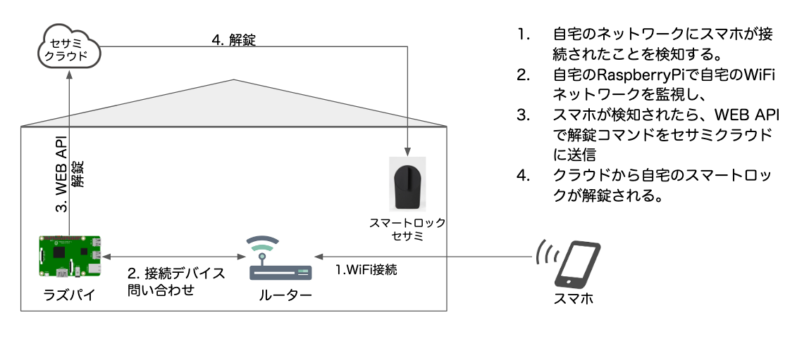

# 背景
スマートロックセサミを用いることで、スマホアプリから自宅の鍵を操作することができる。しかし、スマホ操作が前提のため両手がふさがっていると解錠ができない。IFTTT連携によりスマホのGPS情報から自動解錠することは可能だが、GPSの精度が不十分で自宅に到着しても解錠されないなどの課題があった

# 概要
スマホ操作なしでも玄関前で必ず自動解錠してくれるシステムを作成した。
ラズパイで自宅のWiFiネットワークを監視、自宅ネットワークにスマホが接続されたことを検出したら、WebAPIによりセサミを解錠。
GPSに頼らず、WiFiルーターへの接続を解錠のトリガーとすることで、玄関前では必ずセサミが解錠している状態を実現する。

# 構成図

# 参考
[API仕様](https://docs.candyhouse.co/)
